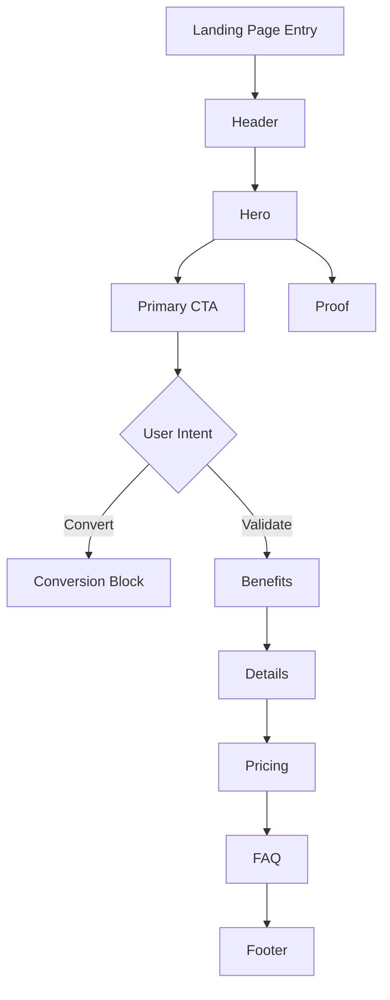

# SKILL: Landing Page Structural & UX Review Framework
Version: 1.0
Purpose: Deterministically evaluate whether a landing page is structurally, visually, and functionally correct.

---

# 1. Core Model

A correct landing page is:

1. A high-signal decision page.
2. Front-loaded with value proposition and next step.
3. Structured as progressive question answering:
   - What is this?
   - Is this for me?
   - Why should I trust this?
   - What does it cost / what happens next?
   - What if I have objections?
4. Accessible.
5. Performant.
6. Conversion-oriented.

---

# 2. Canonical Information Architecture

## 2.1 Baseline Section Order (Generic)

1. Header (identity + minimal navigation)
2. Hero (H1 + subhead + primary CTA)
3. Immediate proof (logos / rating / metric)
4. Benefits (3–6 value pillars)
5. How it works / What you get
6. Deep validation (features / use cases / integrations)
7. Pricing / Plan / Ticket block
8. FAQ / Objection handling
9. Secondary CTA + reassurance
10. Footer (legal / policies / accessibility)

---

## 2.2 Page Type Variants

### B2B SaaS
Move earlier:
- Social proof
- Security/compliance
- Integrations

Pricing may move lower if sales-led.

### B2C Subscription
Move earlier:
- Pricing tiers
- Cancellation reassurance

### Ecommerce Product
Move earlier:
- Product gallery
- Purchase CTA
- Delivery/returns

### Lead Gen
Move earlier:
- Offer contents
- Proof
- Privacy reassurance near form

### Event Page
Move earlier:
- Date/location
- Ticket tiers
- Agenda highlights

---

# 3. Above The Fold Rules

Define fold as:
- Mobile: 360x800
- Desktop: 1440x900

Above-the-fold must establish:

1. Clear value proposition (single H1)
2. Supporting clarification
3. One primary CTA
4. Trust hint
5. Critical decision constraints (price, time, eligibility)

---

## 3.1 Above Fold Requirements

- Exactly one `<h1>`
- Primary CTA visible in first viewport
- CTA label must describe outcome
- No auto-advancing carousel
- No blocking modal before interaction
- No scrolljacking
- No illusion of completeness

---

# 4. Below The Fold Structure

Below the fold supports validation:

- Detailed features
- Use cases
- Case studies
- Pricing comparisons
- FAQs
- Secondary reassurance

Must remain scannable:
- Clear headings
- Structured sections
- No hidden critical info inside collapsed UI

---

# 5. Section Patterns

## 5.1 Header

- Logo + brand
- 3–6 navigation links max
- No competing CTAs
- Skip link present
- Semantic `<header>` landmark

---

## 5.2 Hero

Structure:
- Outcome + audience + differentiator
- Short subheading
- One dominant CTA
- Optional secondary CTA (less visual weight)

CTA Rules:
- Verb-led
- Clear expectation
- Not vague (“Get started” must clarify next step)

Avoid:
- Autoplay video
- Moving background
- Rotating hero panels

---

## 5.3 Social Proof

Valid forms:
- Recognisable logos
- Independent ratings
- Specific metrics
- Real testimonials

Avoid:
- Vague superlatives
- Fake-looking testimonials
- No-source claims

---

## 5.4 Benefits / Features

- 3–6 pillars
- Outcome-first headings
- Scannable blocks
- Icon + heading + short description

Avoid:
- Long paragraphs
- Dense UI screenshots without annotation

---

## 5.5 Pricing

- Clear cost
- Clear what's included
- Clear what happens after CTA
- Cancellation terms visible
- No forced sequential access via carousel

---

## 5.6 Forms

Requirements:
- Visible `<label>` for each field
- Required fields marked programmatically and visually
- Inline error + error summary
- Focus moves to error summary
- Errors not colour-only
- Privacy info present at collection

Avoid:
- Placeholder-only labels
- Hidden validation rules
- Excessive fields above fold

---

# 6. Accessibility Requirements

Must meet:

- WCAG 2.2 Level AA baseline
- Contrast 4.5:1 normal text
- Touch targets ≥ 24x24 CSS px
- Reflow at 320px width
- Visible focus state
- Respect prefers-reduced-motion
- Landmarks present (header, main, footer)
- Heading hierarchy logical

Accessibility score is blocker-weighted.

---

# 7. Performance Requirements

Core Web Vitals thresholds:

- LCP ≤ 2.5s (good)
- CLS < 0.1
- INP ≤ 200ms

Red flags:
- Heavy hero media
- Layout shift from dynamic banners
- Large above-fold video

---

# 8. Metadata Requirements

Required:

- `<title>` present
- Meta description present
- Open Graph:
  - og:title
  - og:description
  - og:image (1200x630 recommended)
  - og:type
  - og:url

Structured data (if applicable):
- Product → Product + Offer
- Event → Event
- FAQ section → FAQPage
- General → WebPage

---

# 9. Scoring Model (0–100)

| Category | Weight |
|----------|--------|
| Above Fold Clarity | 20 |
| Information Architecture | 15 |
| Conversion UX | 15 |
| Trust & Reassurance | 10 |
| Accessibility | 25 |
| Performance | 10 |
| Metadata | 5 |

Fail Threshold:
- < 60 overall = structurally weak
- < 50 = high risk
- Any blocker failure = automatic fail

---

# 10. Deterministic Audit Rules

## Structure

- One `<h1>`
- Landmarks present
- Logical heading order
- Sections clearly separated

## CTA

- Primary CTA visible above fold
- CTA describes outcome
- CTA matches destination

## Forms

- Labels present
- Required marked
- Accessible error handling
- Privacy link present

## Accessibility

- Contrast valid
- Focus visible
- Touch targets sufficient
- Reflow valid

## Performance

- LCP not hero video unless optimized
- No CLS from injected banners

## UX Anti-Patterns

Fail if:
- Auto-rotating carousel
- Scrolljacking
- Early modal interruption
- Login wall before value
- Critical information hidden in accordion only

---

# 11. Structural Flow Diagram

---

# 12. Key Principle

Above the fold = convince to scroll or click.
Below the fold = justify the decision.

Clarity > Cleverness
Hierarchy > Decoration
Trust > Aesthetics
Accessibility > Animation
